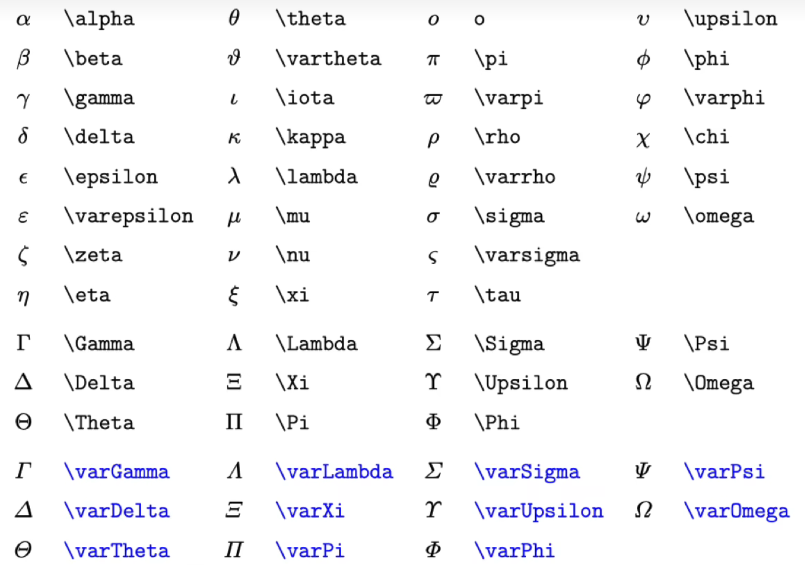
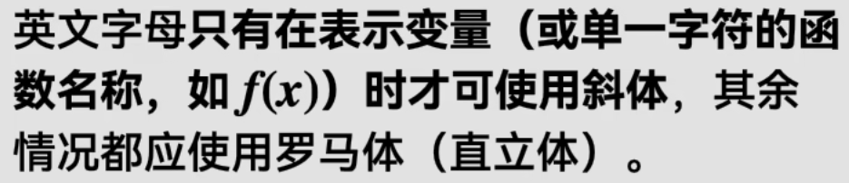
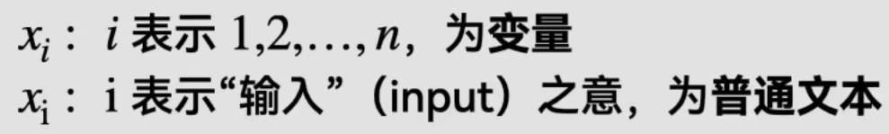
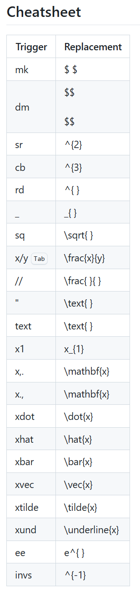
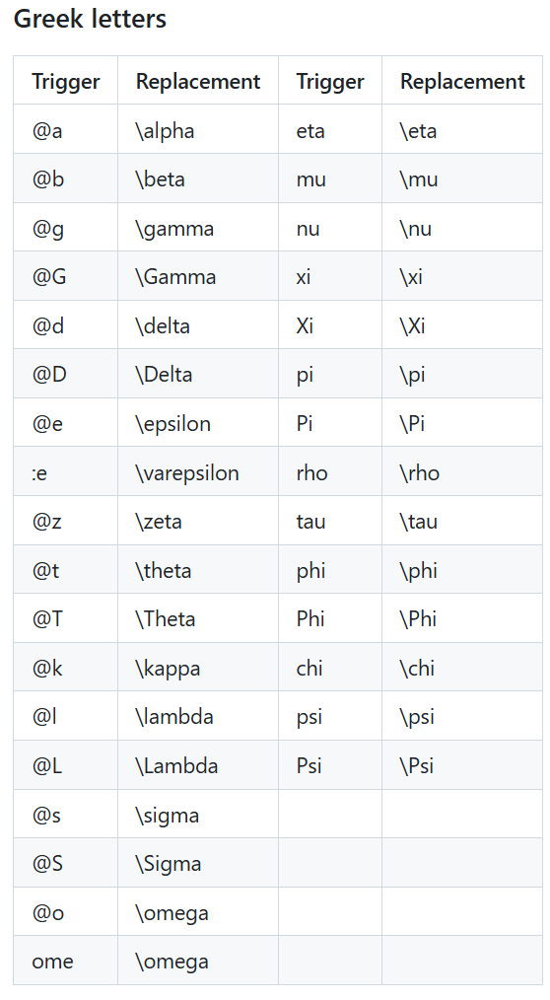

#深度学习从零开始 #框架式的全面学习
>**该笔记是Nagisa在学习[《动手学深度学习》](https://zh.d2l.ai/)时的学习笔记，笔者认为，学习深度学习，是需要从零开始对神经网络、机器学习的一个总体框架和认识，本文笔记会十分的长，用作自己复习时使用，希望也可以帮到看这篇笔记的你！**

# 数学基础
## 数据操作基础
- 见[代码仓库文件及其注释](https://github.com/nagisa1201/nagisa_notes/blob/main/code_repos/1.data_operation/data_operation.ipynb)
# ***穿插重点：LaTex数学公式***
由于笔记后将会出现大量的数学公式，笔者不希望通过截图让笔记变得过于冗余和格式错误，故自学了LaTex的数学公式排版。
## 首先附LaTex数学公式表

### 上下标
- 对于**单个变量（字符）**而言，直接加^表示上标（shift+6），加_表示下标
- 对于**多个字符而言**，需要加{}将都要上标或者下标的内容框起来才可以正常渲染
### 直立体和斜体

以一个例子为例：

- $x_{i}$：可以直接通过x_i打出，默认斜体，表示的是变量
- $x_{\text{i}}$：**需要通过x_{\rm i}(\rm表示roman罗马体)或者x_{\text i}**
>*Q:罗马体和文本又有什么区别呢？*
>*A:\text{A B}可显示空格A B，但\rm{A B}直接显示渲染出的AB*，**且\text A B只会对A生效，而\rm A B会对两者生效**
### 分式和根式
- **分式的嵌套**$\frac{{\frac{1}{x+1}+3}}{y+1}$
- frac{{\\***（d）***frac{1}{x+1}+3}}{y+1}使用这样的方式，且可以在图中地方加上***d***，可以将那个部分的分式变大，如图所示$\frac{{{\dfrac{1}{x+1}+3}}}{y+13}$
- 根式则是\sqrt[114514]{ 0721+00x }即$\sqrt[114514]{ 0721+00x }$

### 普通运算符
- +，-同理
- \pm,\mp对应$\pm$，$\mp$
- 叉乘、点乘、除分别对应$\times$，$\cdot$，$\div$
- ><同理
- 大于等于和小于等于，远大于远小于，不等于、约等于、恒等于对应$\ge$,$\le$，$\gg$，$\ll$，$\ne$，$\approx$，$\equiv$
- 集合运算符$\cap$，$\cup$，$\in$，$\not\in$，$\subseteq$，$\subsetneqq$，$\varnothing$
- 逻辑表达式$\forall$，$\exists$，$\nexists$，$\because$，$\therefore$
- $\mathcal F$，$\mathscr F$傅里叶变换，$\mathscr L$拉普拉斯变换
- $\infty$，$\partial$，$\nabla$，$\degree$，$\propto$
- $\sin x$，$\cos x$，$\sec x$等三角函数
- $\log x$，$\ln x$，$\lim_{x \to 0} \dfrac {x}{\sin x}$(有的不会显示可以改成$\lim\limits_{x \to 0} \dfrac {x}{\sin x}$）
- 直体符号$\text{MSE}(x)$
### 数集类
- $Q$，$R$，$N$，$Z_{+}$，$\mathbb R$，$\mathbb Q$
### 大型运算符
- $\sum$，$\prod$
- 加上限定修饰$\sum\limits_{i=0}^{n}$，$\dfrac{\sum\limits_{i=0}^N isini}{\prod\limits_{i=1}^kx_{i}}$
- 积分符号$\int$，$\iint$，$\iiint$，$\oint$，$\oiint$（此处是二次回路积分不知道为什么渲染不出来）
- 上下限的积分$\int_{-\infty}^{\infty}f(x)dx$，此后为更严谨的写法$\int_{-\infty}^{\infty}f(x)\,\text d x$(\\,和\\ 是LaTex规定的空出小间距，而\\quad，\\qquad则是更大间距)
### 标注符号
![[Pasted image 20250731212954.png]]
以及补充的下方：
![[Pasted image 20250731212943.png]]
### 箭头 
![[Pasted image 20250731213127.png]]
### 括号与界定符
![[Pasted image 20250731214213.png]]
>***对于第四行的解释：我们希望这个|能够自适应长度，但是没有对应的括号与之对应，因此我们在开头用\left.虚拟一个左括号然后把|当做右括号就可以自适应其大小了***
### 多行公式与大括号
![[Pasted image 20250731215837.png]]
>***注意：&符号的意思是前后的&后的东西会对齐***
![[Pasted image 20250731220039.png]]
### 矩阵
![[Pasted image 20250731220229.png]]
## 对于Obsidian的Latex Suite插件而言的笔记：与Latex略有区别，但基本类似
附官方仓库表格：

- 其中，表格一是**排版，算符等的代替**，表格二是**希腊字母**的所有代替
# 线性神经网络
## 基本元素：线性模型的根本
### 损失函数loss function：量化目标实际值和预测值之间的差距
- 常用损失函数为平方误差函数，样本 
- 