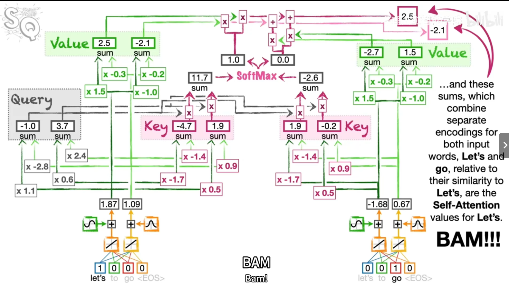
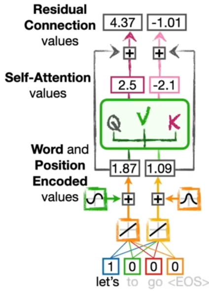
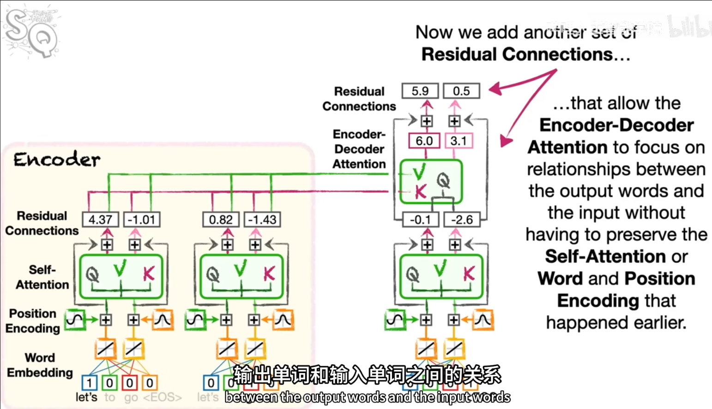
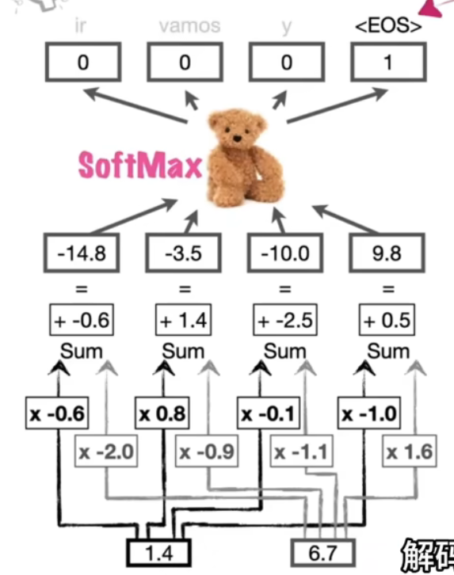
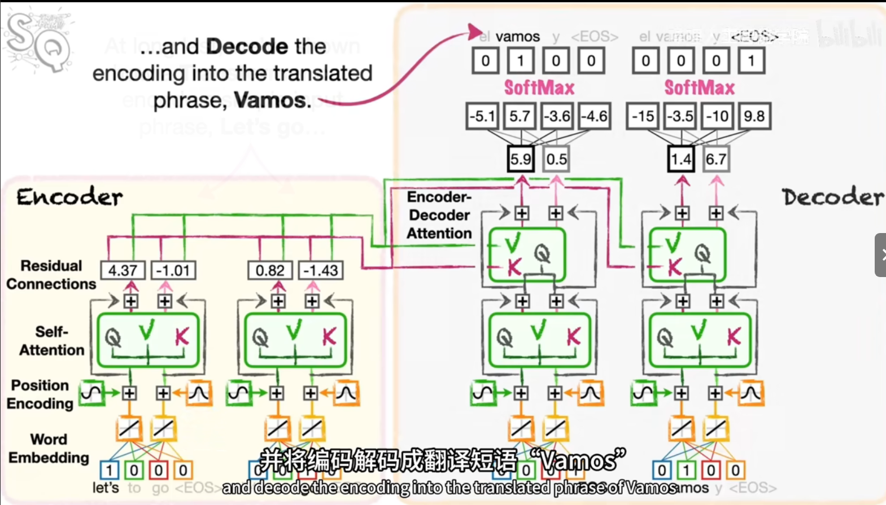

#神经网络基础
# Transformer所需知道的名词
#词嵌入与位置编码 #自注意力机制 #softmax_function
## 编码器部分Encoder
### 词嵌入与位置编码：将单词编码为数字、编码单词的位置
- 将一句话中的每个单词经过词嵌入（反向传播确定权重参数），将单词变化为向量
- 位置编码则是利用正余弦函数得到位置向量，***可以保持对整句话中词序的追踪***
### 自注意力机制：编码单词之间的关系
***解决词与词关系的机制***
> *Q,V,K为三种不同的参数矩阵，是允许复用的*，称为***注意力单元***，其中Q,K矩阵（query、key）计算相似权重，进入softmax层算出相似概率，V矩阵承载信息数据，与概率加权后得到最终结果，注意力权重确定后，V 被加权聚合，生成上下文感知的新表示。
### 残差连接：使该模型可以相对容易和快速的训练，每一个注意力单元都需要添加
***解决自注意力流程中需兼顾词嵌入和位置编码信息不丢失的问题***
>旁路残差连接，注意力机制接管处理词与词之间的关系时无需保留词嵌入和位置编码信息，而是通过处理过后的残差介入来加入这一关系。
### 总结
**实际上，对于每个单词而言，只是不停地复制更多如上相同的单元进行编码。通过每个单词的单元化处理，Transformer可以同时编码计算，并行处理，同时计算每一步而非顺序单独计算。**
## 解码器Decoder
### 编码器解码器注意力层：解决不漏掉编码器输入句子的重要词句的问题
>*Q:为什么编码器解码器注意力层（交叉注意力层）的K、V输出来源于解码器输出后再次进行Key和Value的计算？
>A:​​Key专注于相似度计算，Value专注于信息传递。Key当决定某个单词应该被翻译为什么时，决定每个输入单词应当使用的百分比（Key的结果经过了Softmax层转化为概率）。Value决定内容（与概率相乘后）。*****这样的交叉注意力层是为了翻译时不要漏掉编码器输入句子的重要词句***

>**Q:交叉注意力层中Query的来源？
>A:交叉注意力层的Query直接继承自解码器前一层的输出向量，经过一个可学习的Wq矩阵得到。***

>**Q:交叉注意力层后还存在一个Linear层和Softmax层的意义？
>A:
>Linear层主要是将注意力单元输出的高维语义向量映射到词汇空间，解决“抽象特征无法直接对应词语”的问题；而Softmax层主要是通过概率的方法解决训练时损失函数返回和后续推理输出最大概率项。**
### 基础模型总述

# 了解神经网络需要知道的名词
#反向传播 
