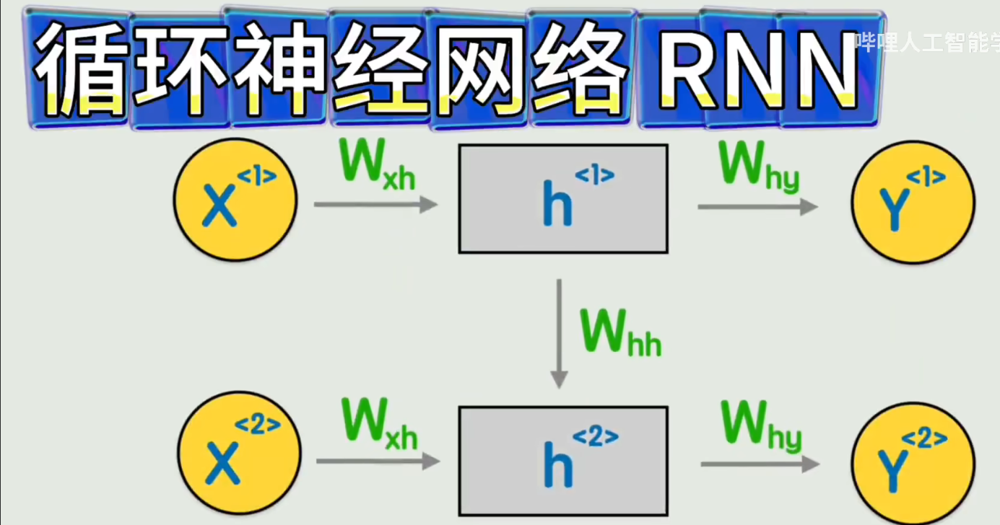
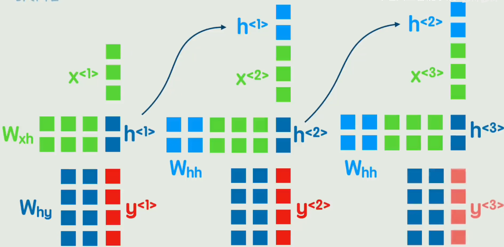
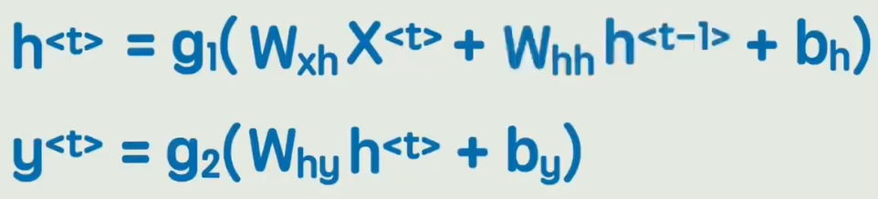
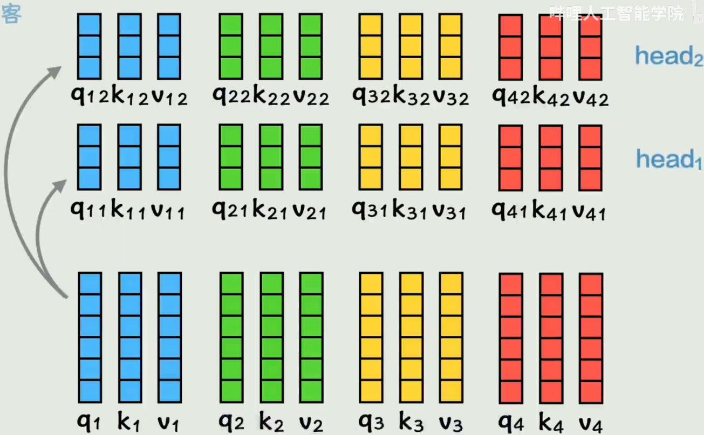
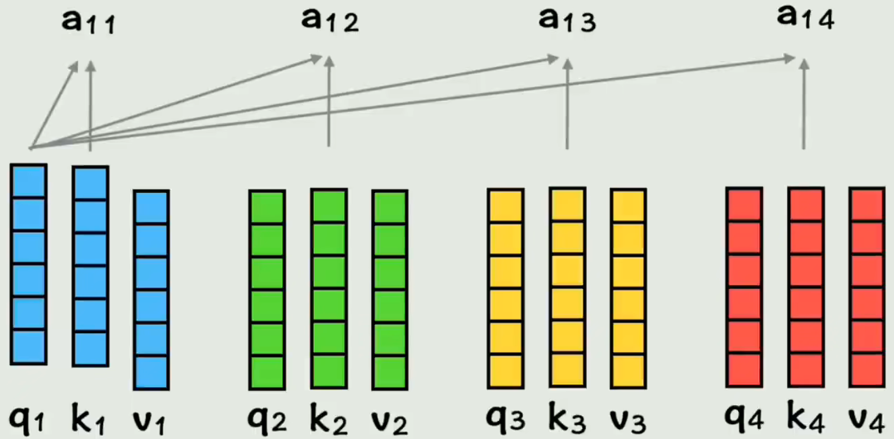
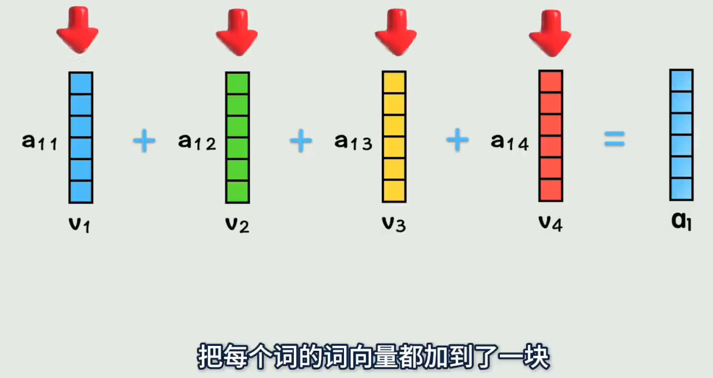
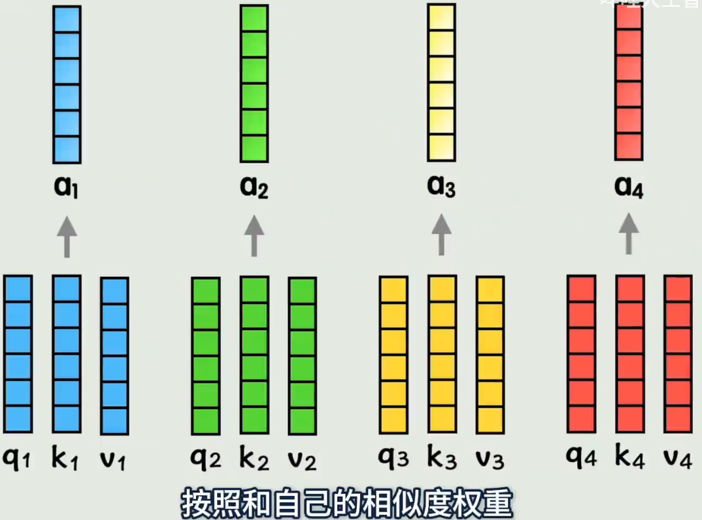
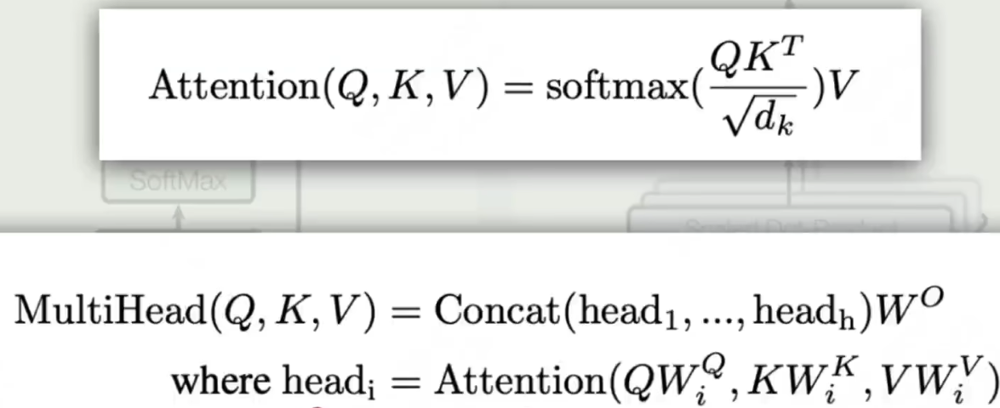
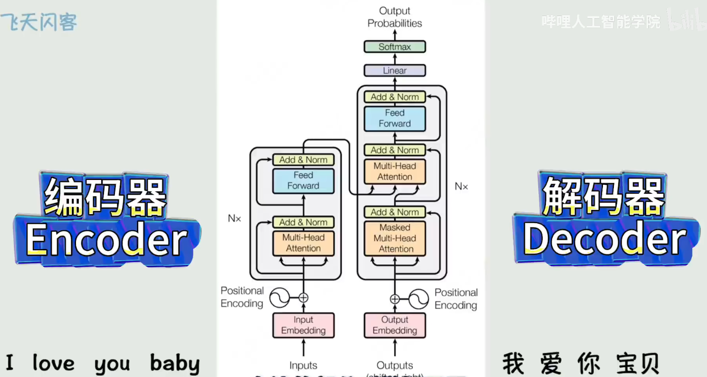

#transformer #当下最火的简单大模型框架
# 为什么需要Transformer变形金刚
## RNN的好与坏

- ***RNN的计算方式***[矩阵方式]

矩阵行列不变的计算，将t-1的部分处理后并入t时刻的传入矩阵、
- ***计算公式***

### RNN缺点
- 无法捕捉长期依赖
- 无法并行，必须一步一步顺序计算

# Transformer模型
## 模型的编码、计算方式核心
 - 将词向量用Wq、Wk、Wv相乘的到三个变换词向量
 - *关系性判断*：变换词向量之间的相似度
### ***Attention注意力机制，Multi-Head Attention多头注意力机制
   - Dot单头注意力：Q、K矩阵相乘后经过√dk缩放，经过Softmax处理后与V矩阵相乘

   - 多头：将QKV矩阵经过多个权重矩阵，拆分到多个头中分别经过注意力机制运算（单头运算），之后合并经过一次矩阵运算

### 训练流程
#### 编码器段
- 输入词句，词嵌入引入位置编码
- 经过多头注意力，残差和归一化处理
- 送入一个全连接神经网络，再进行残差和归一化处理，把结果送入多头注意力机制的两个输入中作为KV矩阵 
#### 解码器段
- 输入翻译文本，词嵌入引入位置编码
- 多头注意力，残差和归一化处理送入多头注意力机制Q矩阵 ***（注意）：Masked代表存在掩码，会遮盖当前翻译字/词的后面词句，模拟真实推理时的逐字翻译
- 之后残差归一化后进入全连接神经网络，再次残差归一化，后进入一层线性变化神经网络投射大表格中，再进入softmax层计算概率